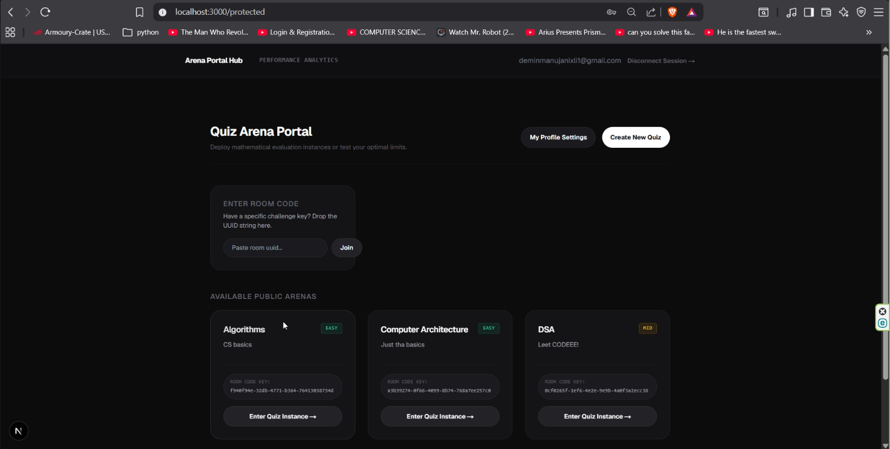
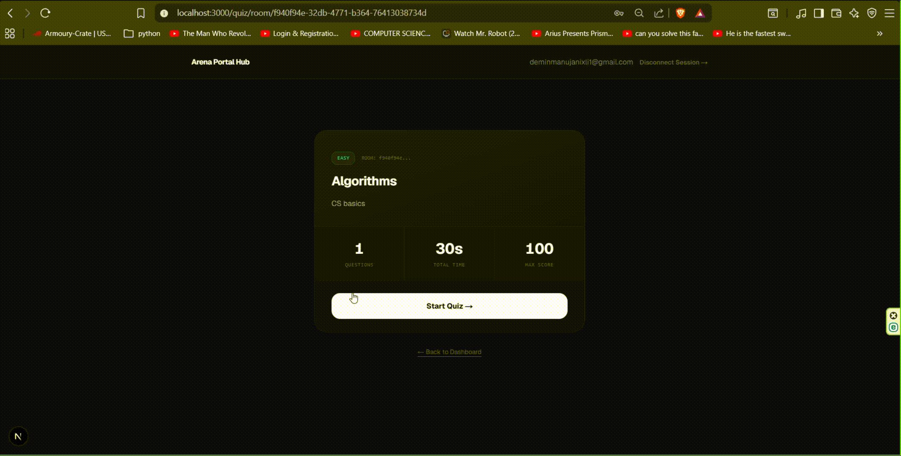
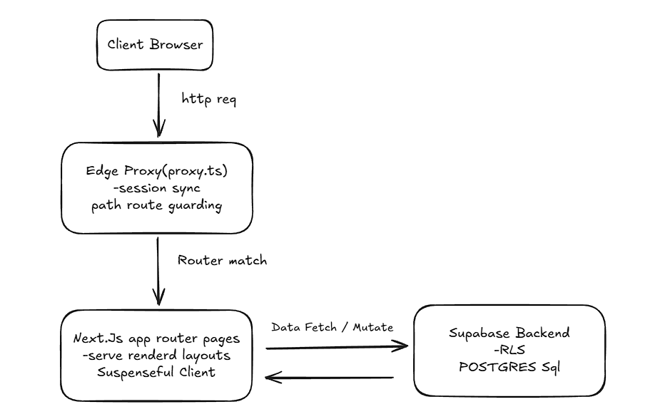
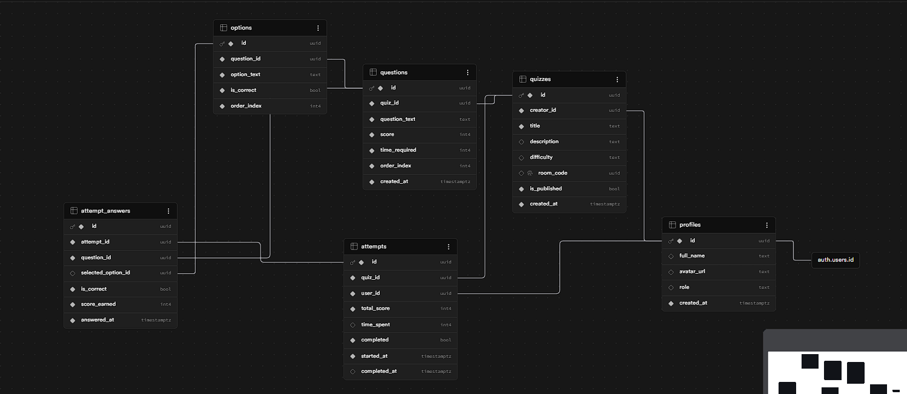

# Quiz Me - Session based quiz completion optimized platform

A premium, highly-interactive, and performant full-stack quiz platform designed to deliver instant feedback, per-question countdowns, and dynamic room-based lobby matchmaking.

Built with **Next.js 16 (Turbopack)**, **TailwindCSS**, and **Supabase (PostgreSQL, SSR Client, & Auth)**.

---

## 🎨 Application Screenshots & Interaction Demos

### 🖥️ Creator Dashboard & Lobby Live Status
<!-- Replace the source below with your actual screenshot path -->

*Dashboard showing active quizzes and real-time room codes.*

### ⏱️ Timed MCQ Attempt Walkthrough

*Interactive attempt viewport demonstrating the automatic time-limit progression.*

---

## 🏗️ System & Route Architecture

The platform operates on a robust, state-of-the-art hybrid rendering model combining Next.js Server Components, client interactivity, and a custom edge request proxy router to protect sessions.

### 1. Edge Request Proxy Routing & Guarding
Because this project utilizes specialized compute nodes and cookie-synchronized server-side rendering (SSR) clients, standard Next.js middleware is replaced by [proxy.ts](file:///d:/quiz-me-app/proxy.ts) at the project root.
- **Session Syncing**: The proxy intercepts incoming requests and invokes [lib/supabase/proxy.ts](file:///d:/quiz-me-app/lib/supabase/proxy.ts) to read the user session cookie, fetch verified JWT claims directly, and refresh expiration timestamps.
- **Route Guarding Rules**:
  - `/protected/**` and `/quiz/attempt/**` routes are marked as secure. Unauthenticated requests are immediately redirected to `/auth/login`.
  - `/auth/login` and `/auth/sign-up` are redirect-guarded. Authenticated users attempting to view these pages are redirected back to the `/protected` dashboard.
  - All other pages (like `/` or `/quiz/room/[roomCode]`) remain public.

### 2. Suspenseful Client Hydration
In Next.js 15 & 16, accessing uncached dynamic data (such as page parameters or URL search arguments) during static generation triggers build failures. 
- To support **Partial Prerendering (PPR)**, dynamic pages are wrapped in a nested `<Suspense>` boundary pattern.
- The parent route page receives `params` or `searchParams` as native promises and passes them down directly to child container components (e.g. `QuizManageContent`, `QuizRoomContent`, and `QuizAttemptContent`).
- The child components unwrap these dynamic parameters asynchronously using React 19's `use()` hook, ensuring that layout skeletons can be statically rendered immediately while the dynamic content streams in.

---

## 🗄️ Database Architecture & Relational Schema

The backend uses **Supabase PostgreSQL** with strict relational integrity and cascading deletes.

### Key Schema Mechanisms
- **Room Code Matching**: The `room_code` is a uniquely indexed UUID assigned to every quiz instance. Attempters join rooms by matching this UUID without exposing the direct quiz ID.
- **Verification Triggers**: Correctness checking on answers occurs entirely inside the backend API transaction layer. When submitting a choice to [app/api/attempts/[attemptId]/answers/route.ts](file:///d:/quiz-me-app/app/api/attempts/[attemptId]/answers/route.ts), the API matches `selected_option_id` against the official database records in the `options` table to determine `is_correct` and calculates the point credit earned.

---

## 🔌 API Reference & Endpoint Matrix

| Method | Endpoint | Request Body | Security Level | Purpose |
| :--- | :--- | :--- | :--- | :--- |
| **GET** | `/api/quizzes` | *None* | Authenticated | List all active quizzes (split into own vs other public arenas). |
| **POST** | `/api/quizzes` | `{"title", "description", "difficulty"}` | Authenticated | Create a new quiz blueprint. |
| **GET** | `/api/quizzes/[quizId]` | *None* | Authenticated | Fetch full details, questions, and choices of a quiz (creator-only verification). |
| **POST** | `/api/quizzes/[quizId]/questions` | `{"question_text", "score", "time_required", "options"}` | Creator-only | Appends a new multiple-choice question and options to a quiz. |
| **DELETE** | `/api/quizzes/[quizId]/questions/[questionId]` | *None* | Creator-only | Permanently delete a question. |
| **GET** | `/api/quizzes/room/[roomCode]` | *None* | Public | Retrieve quiz parameters (title, description, duration) using the room lobby key. |
| **POST** | `/api/attempts` | `{"quiz_id"}` | Authenticated | Create a new attempt record or return an uncompleted active attempt to resume. |
| **POST** | `/api/attempts/[attemptId]/answers` | `{"question_id", "selected_option_id"}` | Attempter-only | Log option submission, determine correctness on-the-fly, and credit points. |
| **PATCH** | `/api/attempts/[attemptId]` | `{"total_score", "time_spent"}` | Attempter-only | Set attempt state to `completed = true` and log cumulative metrics. |

# How to Run
1. create a *.env.local* file 
2. paste the credientials give in the atachment file 
3. install dependencies 
4. run : npm run dev
5. view the localhost:3000 to view the full page on your browser 